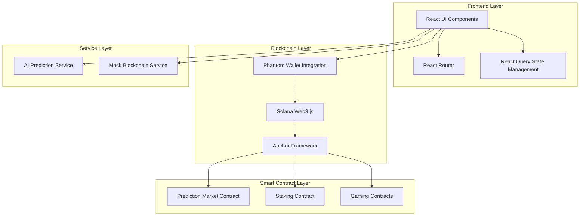

# Stake-Onchain Technical Documentation

## Table of Contents
1. [System Architecture](#system-architecture)
2. [Smart Contracts](#smart-contracts)
3. [Frontend Architecture](#frontend-architecture)
4. [Blockchain Integration](#blockchain-integration)
5. [AI Integration](#ai-integration)
6. [Security Considerations](#security-considerations)
7. [Deployment Guide](#deployment-guide)

## System Architecture

### Overview
Stake-Onchain is a decentralized prediction market platform built on the Solana blockchain. The system architecture consists of four main layers:

1. Frontend Layer
2. Blockchain Layer
3. Smart Contract Layer
4. Service Layer

### Component Diagram


## Smart Contracts

### Prediction Market Contract
The Prediction Market Contract is the core smart contract that handles:
- Market creation
- Betting functionality
- Market resolution
- Winnings distribution

Key functions:
```rust
pub fn create_market(
    ctx: Context<CreateMarket>,
    title: String,
    description: String,
    end_time: i64,
    tags: Vec<String>
) -> Result<()>

pub fn place_bet(
    ctx: Context<PlaceBet>,
    amount: u64,
    prediction: bool
) -> Result<()>

pub fn resolve_market(
    ctx: Context<ResolveMarket>,
    result: bool
) -> Result<()>

pub fn claim_winnings(
    ctx: Context<ClaimWinnings>
) -> Result<()>
```

### Staking Contract
The Staking Contract manages:
- Token staking
- Rewards distribution
- Staking periods

### Gaming Contracts
Gaming contracts include:
- Coin Flip
- Dice Roll
- Additional games (planned)

## Frontend Architecture

### Component Structure
```
src/
├── components/
│   ├── layout/
│   │   ├── Navbar.tsx
│   │   └── Footer.tsx
│   ├── markets/
│   │   ├── MarketCard.tsx
│   │   ├── CreateMarket.tsx
│   │   └── MarketDetail.tsx
│   └── games/
│       ├── CoinFlip.tsx
│       └── Dice.tsx
├── pages/
│   ├── Home.tsx
│   ├── Markets.tsx
│   └── Games.tsx
└── services/
    ├── solanaService.ts
    └── aiPredictionService.ts
```

### State Management
- React Query for server state
- Context API for global state
- Local storage for persistence

## Blockchain Integration

### Wallet Integration
```typescript
// Wallet connection
export const connectWallet = async () => {
  try {
    if (!window.solana) {
      throw new Error("Phantom wallet not installed");
    }
    
    const resp = await window.solana.connect();
    const publicKey = resp.publicKey.toString();
    
    const balance = await connection.getBalance(new PublicKey(publicKey));
    const balanceInSol = balance / LAMPORTS_PER_SOL;
    
    return {
      connected: true,
      address: publicKey,
      balance: balanceInSol
    };
  } catch (error) {
    console.error("Failed to connect wallet:", error);
    throw error;
  }
};
```

### Transaction Handling
```typescript
export const sendTransaction = async (
  amount: number,
  toAddress: string
): Promise<string> => {
  if (!isPhantomInstalled()) {
    throw new Error("Phantom wallet not installed");
  }
  
  try {
    const transaction = new Transaction().add(
      SystemProgram.transfer({
        fromPubkey: new PublicKey(window.solana.publicKey.toString()),
        toPubkey: new PublicKey(toAddress),
        lamports: amount * LAMPORTS_PER_SOL
      })
    );
    
    const signed = await window.solana.signTransaction(transaction);
    const signature = await connection.sendRawTransaction(signed.serialize());
    
    return signature;
  } catch (error) {
    console.error("Transaction failed:", error);
    throw error;
  }
};
```

## AI Integration

### Prediction Service
The AI prediction service analyzes market data and provides:
- Market outcome predictions
- Probability calculations
- Trend analysis

```typescript
export const getAIPrediction = async (
  marketId: string,
  title: string
): Promise<{
  yesPercentage: number;
  noPercentage: number;
}> => {
  // AI prediction logic
  return {
    yesPercentage: calculateYesProbability(title),
    noPercentage: calculateNoProbability(title)
  };
};
```

## Security Considerations

### Smart Contract Security
1. Access Control
   - Owner-only functions
   - Role-based permissions
2. Input Validation
   - Parameter bounds checking
   - Type validation
3. Reentrancy Protection
   - Checks-Effects-Interactions pattern
4. Error Handling
   - Custom error types
   - Graceful failure handling

### Frontend Security
1. Input Sanitization
2. XSS Prevention
3. CSRF Protection
4. Secure Storage

## Deployment Guide

### Prerequisites
- Node.js v16+
- Solana CLI
- Anchor Framework
- Phantom Wallet

### Development Setup
1. Clone repository
2. Install dependencies
3. Configure environment variables
4. Start development server

### Production Deployment
1. Build frontend
2. Deploy smart contracts
3. Configure production environment
4. Deploy to hosting service

### Monitoring
1. Error tracking
2. Performance monitoring
3. User analytics
4. Blockchain metrics 